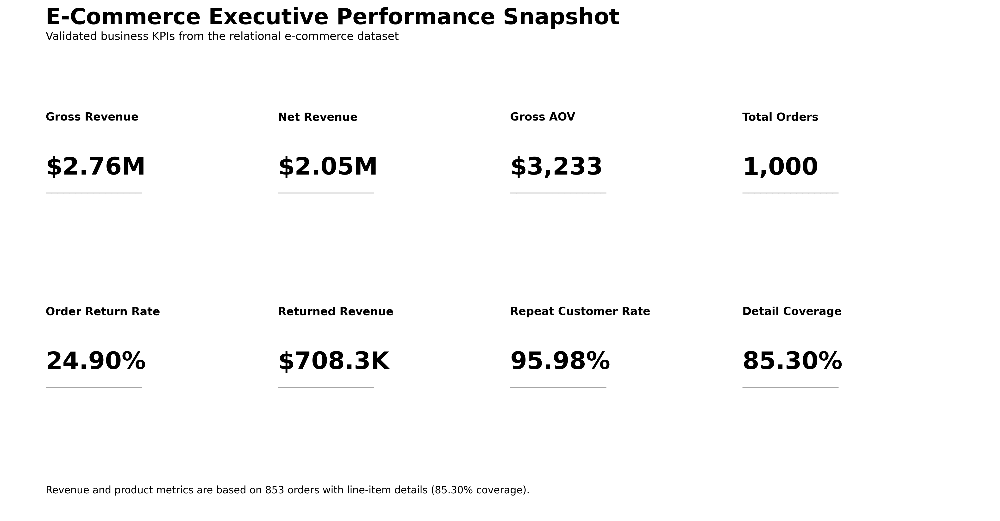

# E-Commerce Sales & Customer Intelligence Using SQL


## 📌 Project Overview

This project analyzes a relational e-commerce database using **MySQL 8** to uncover insights across revenue, customer behaviour, product performance, regional performance, purchasing patterns, and returns.

The project contains **25 validated SQL business analyses** using joins, CTEs, conditional aggregation, subqueries, date analysis, and window functions.

Core analytical results were independently reconciled using **Python and Pandas**, followed by an executive visualization layer and a **12-slide PowerPoint presentation**.

> **Data-quality note:** The database contains 1,000 orders, but only 853 orders have corresponding line-item records in `OrderDetails`. Therefore, order-level metrics use all 1,000 orders, while revenue, AOV, product, category, and unit-based metrics use the 853 orders with available transaction details.

---

## 🎯 Business Objectives

The analysis was designed to answer five major business questions:

1. How much measurable revenue is the business generating?
2. Which categories, products, and regions drive commercial performance?
3. Which customers contribute the greatest historical value?
4. How frequently do customers purchase and return?
5. Where is return-related financial exposure concentrated?

---

## 📊 Executive KPI Snapshot

| KPI | Result |
|---|---:|
| Gross Revenue | **$2,757,346.10** |
| Net Revenue | **$2,049,059.34** |
| Returned Revenue | **$708,286.76** |
| Returned Revenue Share | **25.69%** |
| Gross AOV | **$3,232.53** |
| Total Orders | **1,000** |
| Order Return Rate | **24.90%** |
| Active Customers | **199** |
| Repeat Customers | **191** |
| Repeat Customer Rate | **95.98%** |
| Units Sold | **6,015** |
| Returned Units | **1,518** |
| Unit Return Rate | **25.24%** |
| Order Detail Coverage | **85.30%** |



Measured gross revenue reached approximately **$2.76M**, while measured net revenue was approximately **$2.05M**.

Approximately **$708.3K of measured revenue is associated with returned orders**, making returns one of the clearest areas for commercial investigation.

---

## 🗄️ Database Structure

The analysis uses five relational tables:

| Table | Rows | Purpose |
|---|---:|---|
| `Regions` | 10 | Geographic region and country |
| `Customers` | 200 | Customer information and regional assignment |
| `Orders` | 1,000 | Order date, customer and return status |
| `OrderDetails` | 2,000 | Product and quantity information |
| `Products` | 100 | Product, category and unit price |

### Relationship Model

```text
Regions
   |
   v
Customers
   |
   v
Orders
   |
   v
OrderDetails <----- Products
