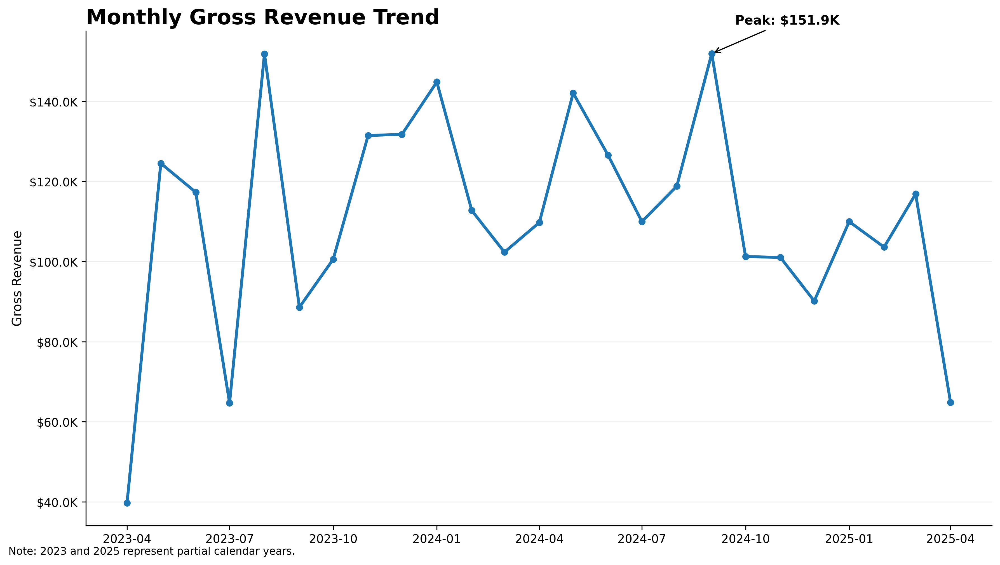
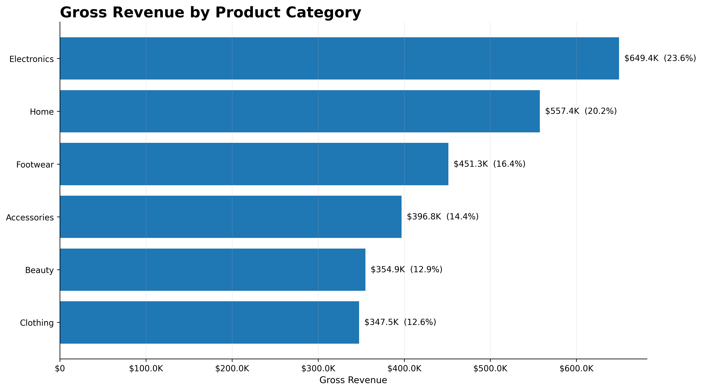
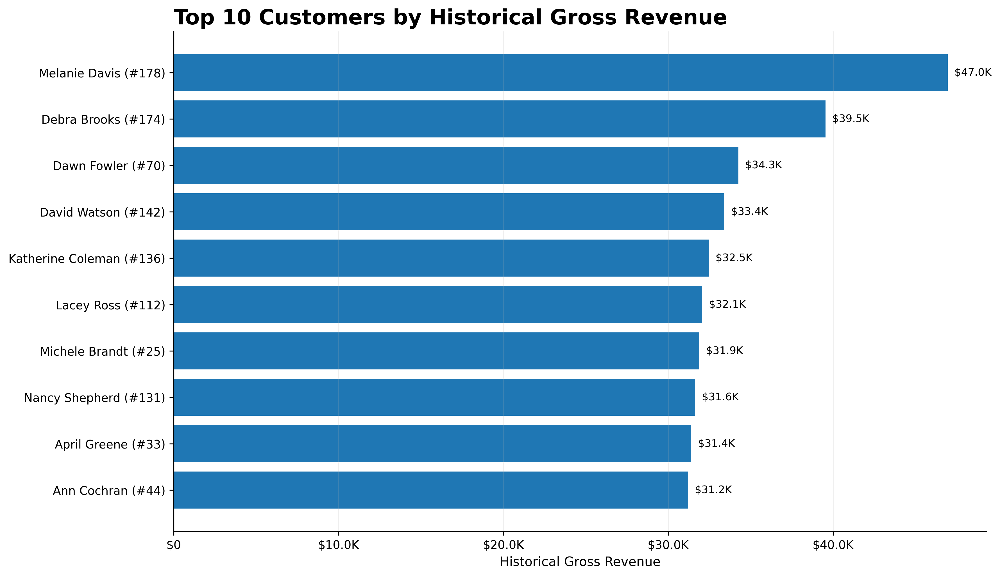
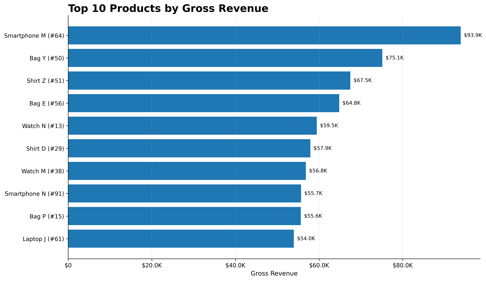
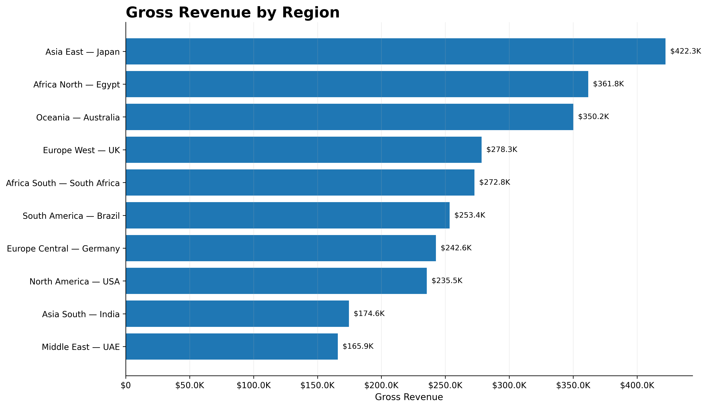
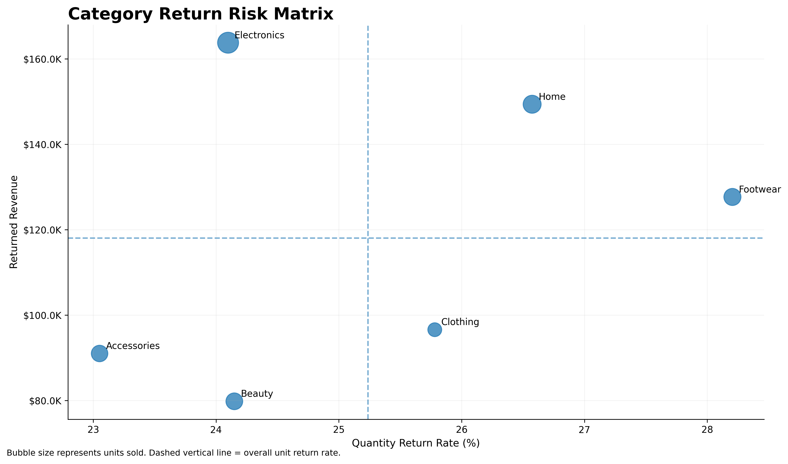
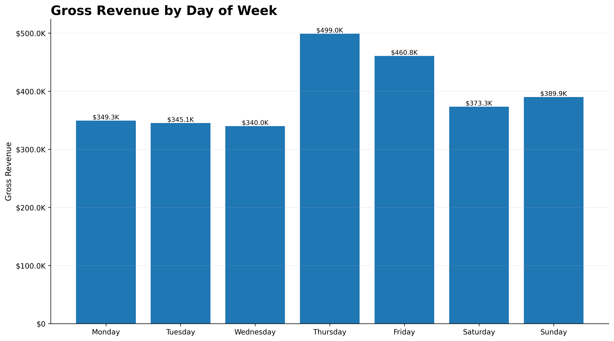

# E-Commerce Sales & Customer Intelligence Using SQL

**Tools:** MySQL 8 | SQL | Python | Pandas | Google Colab | Matplotlib | PowerPoint

> End-to-end e-commerce analytics project covering revenue, customer behaviour, product performance, regional performance, purchasing patterns, and commercial return risk.

## Project Resources

| Resource | Link |
|---|---|
| SQL Business Analysis | [View 25 SQL analyses](sql/03_business_analysis.sql) |
| Data Quality Checks | [View SQL validation](sql/02_data_quality_checks.sql) |
| Database Schema | [View database schema](sql/01_schema.sql) |
| Python / Colab Notebook | [View analysis notebook](notebooks/Ecommerce_SQL_Analytics.ipynb) |
| Executive Presentation | [View PowerPoint](presentation/Ecommerce_SQL_Analytics_Presentation.pptx) |
| Source Data | [View datasets](data/) |
| Analytical Results | [View results](results/) |

---

## Project Overview

This project analyzes a relational e-commerce database using **MySQL 8** to transform transactional data into actionable commercial insights.

The analysis contains **25 validated SQL business analyses** covering:

- Revenue and sales performance
- Customer behaviour and historical value
- Product and category performance
- Regional performance
- Purchasing frequency
- Return behaviour and financial exposure

Core KPIs were independently reconciled using **Python and Pandas**, followed by executive visualizations and a **12-slide PowerPoint presentation**.

> **Important data-quality note:** The database contains 1,000 orders, but only 853 orders have corresponding line-item records in `OrderDetails`. Order-level metrics therefore use all 1,000 orders, while revenue, AOV, product, category, and unit-based metrics use the 853 orders with available transaction details.

---

## Executive KPI Snapshot

| KPI | Result |
|---|---:|
| Gross Revenue | **$2,757,346.10** |
| Net Revenue | **$2,049,059.34** |
| Returned Revenue | **$708,286.76** |
| Returned Revenue Share | **25.69%** |
| Gross AOV | **$3,232.53** |
| Total Orders | **1,000** |
| Order Return Rate | **24.90%** |
| Active Customers | **199** |
| Repeat Customers | **191** |
| Repeat Customer Rate | **95.98%** |
| Units Sold | **6,015** |
| Returned Units | **1,518** |
| Unit Return Rate | **25.24%** |
| Order Detail Coverage | **85.30%** |


Measured gross revenue reached approximately **$2.76M**, while measured net revenue was approximately **$2.05M**.

Approximately **$708.3K of measured revenue is associated with returned orders**, making returns one of the clearest areas for commercial investigation.

---

## Business Questions

The project was designed to answer five broad commercial questions:

1. How much measurable revenue is the business generating?
2. Which categories, products, and regions drive commercial performance?
3. Which customers contribute the greatest historical value?
4. How frequently do customers purchase and return?
5. Where is return-related financial exposure concentrated?

---

## Database Structure

The analysis uses five relational tables.

| Table | Rows | Purpose |
|---|---:|---|
| `Regions` | 10 | Geographic region and country |
| `Customers` | 200 | Customer information and regional assignment |
| `Orders` | 1,000 | Customer, order date and return status |
| `OrderDetails` | 2,000 | Product and quantity information |
| `Products` | 100 | Product, category and unit price |

### Relationship Model

```text
Regions
   |
   v
Customers
   |
   v
Orders
   |
   v
OrderDetails <----- Products
```

`OrderDetails` acts as the transaction-line bridge between `Orders` and `Products`.

---

## Data Quality Audit

Data quality and relational integrity were checked before performing business analysis.

| Quality Metric | Result |
|---|---:|
| Total Orders | 1,000 |
| Orders With Details | 853 |
| Orders Without Details | 147 |
| Detail Coverage | 85.30% |
| Total Customers | 200 |
| Customers With Orders | 199 |
| Products | 100 |
| Returned Orders | 249 |
| Order Return Rate | 24.90% |

The dataset covers transactions from **15 April 2023 through 14 April 2025**.

The 147 orders without `OrderDetails` are retained for valid order-level analysis but excluded from calculations requiring price, product, quantity, or line-level revenue.

---

## Revenue Performance



The highest observed monthly gross revenue occurred in **September 2024**, reaching approximately **$151.9K**.

| Year | Revenue-Bearing Orders | Gross Revenue |
|---|---:|---:|
| 2023 | 306 | $950,537.58 |
| 2024 | 421 | $1,411,533.93 |
| 2025 | 126 | $395,274.59 |

**2024 is the only full calendar year in the dataset.**

The dataset begins in April 2023 and ends in April 2025. Therefore, the lower 2025 total should not be interpreted as evidence of a full-year revenue decline.

---

## Category Performance



| Category | Gross Revenue | Revenue Share |
|---|---:|---:|
| Electronics | $649,432.66 | 23.55% |
| Home | $557,383.80 | 20.21% |
| Footwear | $451,319.13 | 16.37% |
| Accessories | $396,838.31 | 14.39% |
| Beauty | $354,892.78 | 12.87% |
| Clothing | $347,479.42 | 12.60% |

**Electronics and Home together contribute approximately 43.76% of measured gross revenue.**

Electronics contains more products than several other categories, so revenue leadership should not automatically be interpreted as superior per-product productivity.

---

## Customer Intelligence



**Melanie Davis** generated the highest measured historical customer revenue:

- Gross revenue: **$46,959.01**
- Revenue-bearing orders: **6**
- Gross AOV: approximately **$7,826.50**

### Customer Behaviour

| Metric | Result |
|---|---:|
| Active Customers | 199 |
| Repeat Customers | 191 |
| One-Time Customers | 8 |
| Repeat Customer Rate | 95.98% |

The observed repeat rate is unusually high and should be interpreted in the context of this **synthetic dataset**, rather than used as a real-world e-commerce retention benchmark.

### Customer Segmentation

| Segment | Customers |
|---|---:|
| Platinum | 192 |
| Gold | 3 |
| Silver | 0 |
| Bronze | 5 |

The highly skewed distribution indicates that the assignment-defined fixed spending thresholds are poorly calibrated for this dataset.

For production analysis, **RFM or percentile-based segmentation** would create more useful customer groups.

---

## Product Performance



**Smartphone M (ProductID 64)** is both the highest-revenue and highest-volume product.

| Metric | Result |
|---|---:|
| Gross Revenue | **$93,856** |
| Units Sold | **100** |
| Revenue-Bearing Orders | **30** |

Product names are not unique in the source data. The database contains **100 ProductIDs but only 75 unique product names**.

Product analysis therefore retains **ProductID + ProductName** rather than grouping by product name alone.

---

## Regional Performance



Different regions lead on different commercial metrics:

- **Asia East / Japan** — highest measured regional revenue at **$422,270.04**
- **Africa North / Egypt** — highest regional gross AOV at **$3,654.24**
- **Europe Central / Germany** — highest weighted average purchased unit price at **$491.08**
- **Africa South / South Africa** — highest order return rate at **31.37%**
- **Asia South / India** — lowest order return rate at **19.35%**

Regional performance should therefore be evaluated across multiple dimensions rather than revenue alone.

---

## Returns & Commercial Risk



Return analysis reveals two different forms of commercial risk.

### Return Frequency Risk

**Footwear** has the highest category quantity return rate at **28.21%**.

### Financial Exposure

**Electronics** has the highest returned-revenue exposure at **$163,791.60**.

The category with the highest return frequency is therefore not necessarily the category creating the greatest monetary exposure.

### Products With High Observed Return Rates

| Product | Units Sold | Returned Units | Return Rate |
|---|---:|---:|---:|
| Laptop W | 42 | 21 | 50.00% |
| Shirt A | 65 | 29 | 44.62% |
| Watch V | 78 | 34 | 43.59% |
| Shoes J | 49 | 21 | 42.86% |
| Watch N | 80 | 33 | 41.25% |

Return percentages should be interpreted alongside sales volume rather than ranked in isolation.

---

## Purchasing Behaviour

Average time between consecutive customer orders varies considerably by region.

| Region | Avg. Days Between Orders |
|---|---:|
| South America / Brazil | 85.56 |
| Europe Central / Germany | 92.12 |
| Asia South / India | 107.31 |
| Africa North / Egypt | 110.02 |
| Africa South / South Africa | 110.86 |
| Asia East / Japan | 114.21 |
| North America / USA | 115.15 |
| Europe West / UK | 120.32 |
| Oceania / Australia | 123.88 |
| Middle East / UAE | 140.31 |

**South America / Brazil** shows the shortest observed average interval between purchases, while **Middle East / UAE** shows the longest.

---

## Weekday Performance



- **Thursday** generated the highest measured gross revenue and the largest number of revenue-bearing orders.
- **Sunday** recorded the highest gross AOV.
- **Tuesday** recorded the lowest gross AOV.

These patterns are descriptive and should not be treated as operational forecasts without additional historical data.

---

## SQL Techniques Demonstrated

The SQL analysis demonstrates practical use of:

- Multi-table `INNER JOIN` and `LEFT JOIN`
- Aggregate functions
- Conditional aggregation
- `CASE` expressions
- Common Table Expressions (CTEs)
- Subqueries
- `LAG()` window function
- Date calculations
- Monthly and yearly trend analysis
- Customer segmentation
- Product ranking
- Regional analysis
- Return-rate analysis
- Revenue reconciliation
- Data-quality and relationship validation

---

## Business Recommendations

### 1. Reduce Return Exposure

Investigate **Footwear return frequency** and **Electronics returned-revenue exposure** separately because they represent different operational and financial risks.

### 2. Protect Revenue Leaders

Prioritize availability and commercial monitoring for leading categories and high-performing products.

### 3. Use Regional Targeting

Investigate the behaviours behind **Asia East's revenue leadership**, **Africa North's high AOV**, and **Africa South's elevated return rate**.

### 4. Improve Customer Segmentation

Replace fixed spend thresholds with **RFM or percentile-based segmentation** to create more balanced and actionable customer groups.

### 5. Improve Transaction Completeness

Resolve the **147 orders without `OrderDetails`** before using monetary metrics for complete transaction-level financial reporting.

---

## Project Workflow

```text
Raw CSV Data
      |
      v
Relational MySQL Database
      |
      v
Data Quality & Relationship Validation
      |
      v
25 SQL Business Analyses
      |
      v
Python / Pandas KPI Reconciliation
      |
      v
Executive Visualizations
      |
      v
Business Interpretation
      |
      v
Executive Presentation
```

---

## Repository Structure

```text
ecommerce-sql-analytics/
│
├── data/
│   ├── customers.csv
│   ├── orders.csv
│   ├── orderdetails.csv
│   ├── products.csv
│   └── regions.csv
│
├── sql/
│   ├── 01_schema.sql
│   ├── 02_data_quality_checks.sql
│   └── 03_business_analysis.sql
│
├── notebooks/
│   └── Ecommerce_SQL_Analytics.ipynb
│
├── images/
│   ├── 01_monthly_revenue_trend.png
│   ├── 02_revenue_by_category.png
│   ├── 03_revenue_by_region.png
│   ├── 04_top_10_products_revenue.png
│   ├── 05_top_10_customers.png
│   ├── ...
│   └── 17_revenue_vs_returns_summary.png
│
├── results/
│   ├── executive_kpis.csv
│   ├── executive_insights.csv
│   └── supporting_analysis_tables/
│
├── presentation/
│   └── Ecommerce_SQL_Analytics_Presentation.pptx
│
├── README.md
├── requirements.txt
├── .gitignore
└── LICENSE
```

---

## How to Reproduce the Analysis

### MySQL

1. Run [`sql/01_schema.sql`](sql/01_schema.sql) to create the database structure.
2. Import the five CSV datasets from [`data/`](data/).
3. Run [`sql/02_data_quality_checks.sql`](sql/02_data_quality_checks.sql) to validate the database.
4. Run [`sql/03_business_analysis.sql`](sql/03_business_analysis.sql) to reproduce the 25 business analyses.

### Python / Google Colab

Open the [`Ecommerce_SQL_Analytics.ipynb`](notebooks/Ecommerce_SQL_Analytics.ipynb) notebook.

The notebook independently reconciles core KPIs, generates analytical datasets and visualizations, and supports creation of the executive presentation.

---

## Executive Presentation

The project includes a **12-slide executive presentation**:

**[View the PowerPoint presentation](presentation/Ecommerce_SQL_Analytics_Presentation.pptx)**

It summarizes the business problem, data-quality considerations, executive KPIs, revenue, customers, products, regions, return risk, recommendations, and technical methodology.

---

## Analytical Limitations

1. **147 of 1,000 orders do not contain line-item details**, so monetary and product metrics cover 85.30% of orders.
2. The dataset is **synthetic**, so unusually high repeat-customer behaviour should not be generalized to real businesses.
3. 2023 and 2025 contain **partial calendar years**, making direct full-year comparisons inappropriate.
4. Customer segmentation uses assignment-defined historical-spend thresholds and is not predictive.
5. Historical customer spend is used as a **CLV proxy**, not a predictive customer lifetime value model.
6. Return analysis identifies associations and financial exposure; it does not establish the underlying causes of returns.

---

## What This Project Demonstrates

This project demonstrates an end-to-end analytical workflow:

**Data validation → SQL analysis → KPI reconciliation → visualization → business interpretation → executive communication**

It shows the ability to move beyond query writing and translate relational transaction data into **reproducible analytical results and commercially understandable recommendations**.

---

## Author

**Sombir Singh**

Data Analyst | Business Analyst | Data Management | Python | SQL | Power BI | GenAI / RAG

[GitHub Profile](https://github.com/Sombir001)

---

## License

This project is available under the [MIT License](LICENSE).
